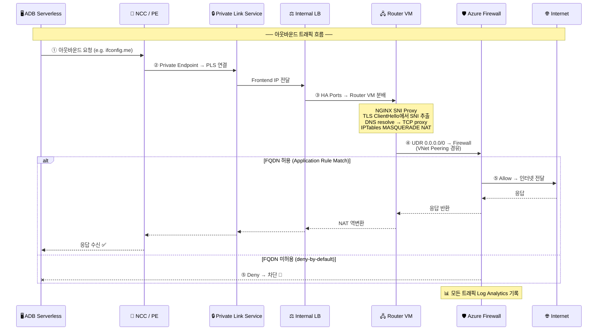

# Azure Databricks Serverless 네트워크 구성 (Private Link + Firewall)

## 개요

Azure Databricks Serverless 환경에서 아웃바운드 트래픽을 고객 VNet의 Azure Firewall로 라우팅하여 FQDN 기반 트래픽 제어, IP 고정, 로깅을 구현하는 솔루션입니다.

### 주요 기능

- **Domain-based PE Rule**: 인터넷 도메인 트래픽을 PLS → LB → Router VM(SNI Proxy) → Firewall 경유로 라우팅
- **Resource-based PE Rule**: Azure PaaS(ADLS Gen2 등)를 Managed PE로 Azure Backbone 직접 연결
- **Network Policy**: PE 미등록 도메인에 대한 플랫폼 수준 deny-all 제어
- **SNI Proxy**: PLS에 의한 목적지 IP 소실 문제를 NGINX Stream SNI Proxy로 해결 (필수)

### 아키텍처

```mermaid
graph TB
    subgraph ADB["☁️ Azure Databricks Control Plane"]
        SL["🖥️ Serverless Compute<br/><i>Notebook / Job / SQL Warehouse</i>"]
    end

    subgraph NCC_BLOCK["🔗 NCC (Network Connectivity Configuration)"]
        PE["Private Endpoint Rule<br/><i>Domain-based routing</i>"]
    end

    subgraph VNETA["📦 VNET A: vnet-databricks — 10.0.0.0/16<br/><i>Proxy 전용 Landing Zone</i>"]
        subgraph FE_SUBNET["snet-lb-frontend — 10.0.2.0/26"]
            PLS["🔒 Private Link Service<br/><b>pls-databricks</b>"]
            LB["⚖️ Internal Standard LB<br/><b>lb-databricks-internal</b><br/><i>HA Ports (All/0)</i>"]
        end
        subgraph BE_SUBNET["snet-lb-backend — 10.0.2.64/26<br/><i>NSG: nsg-backend &nbsp;|&nbsp; UDR: rt-backend-to-firewall</i>"]
            VM1["🖧 Router VM #1<br/><b>vm-router-01</b> (Zone 1)<br/><i>NGINX SNI Proxy :443<br/>Health Probe :8082<br/>IPTables MASQUERADE</i>"]
            VM2["🖧 Router VM #2<br/><b>vm-router-02</b> (Zone 2)<br/><i>HA — 선택적 배포</i>"]
        end
    end

    subgraph VNETB["📦 VNET B: vnet-hub — 10.1.0.0/16<br/><i>Connectivity Landing Zone</i>"]
        subgraph FW_SUBNET["AzureFirewallSubnet — 10.1.0.0/26"]
            FW["🛡️ Azure Firewall<br/><b>afw-hub</b> (Standard)<br/><i>Policy: afwp-hub<br/>FQDN Application Rules<br/>deny-by-default</i>"]
        end
        LA["📊 Log Analytics<br/><b>law-afw-hub</b>"]
    end

    INTERNET["🌐 Internet<br/><i>허용된 FQDN만 통과</i>"]
    BLOCKED["🚫 차단<br/><i>미허용 FQDN</i>"]

    SL -->|"① Outbound 요청"| PE
    PE -->|"② Private Link"| PLS
    PLS --> LB
    LB -->|"③ 트래픽 분배"| VM1
    LB -.->|"③ HA"| VM2
    VM1 -->|"④ MASQUERADE NAT<br/>UDR 0.0.0.0/0 → FW"| FW
    VM2 -.->|"④"| FW
    FW -->|"⑤ Allow (FQDN 허용)"| INTERNET
    FW -->|"⑤ Deny"| BLOCKED
    FW -.->|"로그"| LA

    VNETA <-->|"VNet Peering"| VNETB

    classDef azure fill:#0078D4,stroke:#005A9E,color:#fff,stroke-width:2px
    classDef subnet fill:#E8F4FD,stroke:#0078D4,color:#333,stroke-width:1px
    classDef vm fill:#FFF3E0,stroke:#F57C00,color:#333,stroke-width:1px
    classDef firewall fill:#FFEBEE,stroke:#C62828,color:#333,stroke-width:2px
    classDef pls fill:#E8F5E9,stroke:#2E7D32,color:#333,stroke-width:1px
    classDef blocked fill:#FFCDD2,stroke:#B71C1C,color:#333,stroke-width:2px
    classDef internet fill:#E8F5E9,stroke:#1B5E20,color:#333,stroke-width:2px
    classDef log fill:#F3E5F5,stroke:#6A1B9A,color:#333,stroke-width:1px

    class SL,PE azure
    class FE_SUBNET,BE_SUBNET,FW_SUBNET subnet
    class VM1,VM2 vm
    class FW firewall
    class PLS,LB pls
    class BLOCKED blocked
    class INTERNET internet
    class LA log
```



### 트래픽 흐름 (시퀀스)



## 프로젝트 구조

```
ADBPrivate/
├── infra/
│   ├── main.bicep              # 메인 오케스트레이션
│   ├── main.bicepparam         # 파라미터 파일
│   └── modules/
│       ├── networking.bicep    # VNet, Subnet, Peering, NSG, UDR
│       ├── firewall.bicep      # Azure Firewall + Policy + Log Analytics
│       ├── loadbalancer.bicep  # Internal Standard LB
│       ├── pls.bicep           # Private Link Service
│       ├── vm-router.bicep     # Router VM (cloud-init: SNI Proxy + Health Probe)
│       └── databricks.bicep    # ADB Workspace (Premium)
├── notebooks/
│   ├── test-connectivity.py    # 아웃바운드 트래픽 경로 테스트 (Domain PE)
│   └── test-storage.py         # ADLS Gen2 Storage 접근 테스트 (Resource PE)
├── docs/
│   ├── customer-guide.md       # 고객용 배포/검증 가이드 (전체 문서)
│   └── screenshots/            # 스크린샷 플레이스홀더
├── scripts/
│   ├── deploy.sh               # 인프라 배포 스크립트
│   └── cleanup.sh              # 리소스 정리 스크립트
└── README.md
```

## 사전 요구 사항

| 항목 | 요구 사항 |
|------|----------|
| Azure CLI | 2.50+ |
| Databricks Plan | **Premium** (NCC 지원) |
| Databricks 권한 | Account Admin |
| Azure 권한 | Subscription Contributor 이상 |
| SSH 키 | `~/.ssh/id_rsa.pub` 존재 |

## 배포

### 1단계: 인프라 배포 (자동화)

```bash
# 환경 변수 설정 (선택)
export RESOURCE_GROUP="rg-databricks-networking"
export LOCATION="koreacentral"

# SSH 키가 없으면 자동 생성됨
chmod +x scripts/deploy.sh
./scripts/deploy.sh
```

배포 완료 시 다음 정보가 출력됩니다:
- Azure Firewall Public/Private IP
- Router VM Private IP
- **PLS Resource ID** (NCC 설정에 필요)
- Databricks Workspace URL

### 2단계: NCC 생성 (수동)

1. [Databricks Account Console](https://accounts.azuredatabricks.net/)에 Account Admin으로 로그인
2. **Security** > **Network connectivity configurations** > **Add network configuration**
3. 설정:
   - Name: `ncc-databricks-koreacentral`
   - Region: `koreacentral` (Workspace와 동일)

### 3단계: Private Endpoint Rule 추가 (수동)

1. Account Console > 생성한 NCC 선택
2. **Private endpoint rules** > **Add private endpoint rule**
3. 설정:
   - **Azure resource ID**: 배포 출력의 `PLS Resource ID`
   - **Domain names**: 테스트할 도메인 (예: `ifconfig.me`, `api.ipify.org`)

> ⚠️ Domain names는 Azure 공개 도메인이 아닌, PLS→LB→Router VM 경로를 통해 접근할 커스텀 도메인입니다.

### 4단계: Private Endpoint 승인 (수동)

1. Azure Portal > **Private Link services** > `pls-databricks`
2. **Private endpoint connections** 클릭
3. Pending 상태의 endpoint 선택 > **Approve**

### 5단계: NCC를 Workspace에 연결 (수동)

1. Account Console > **Workspaces** > 대상 Workspace 클릭
2. **Update workspace**
3. **Network connectivity configurations** 에서 생성한 NCC 선택
4. **Update**
5. ~10분 대기

### 6단계: 연결 검증

1. Databricks Workspace 접속
2. `notebooks/test-connectivity.py` 내용을 Serverless Notebook에 붙여넣기
3. **Serverless 컴퓨팅**으로 실행
4. 결과 확인:
   - 외부 IP = Azure Firewall Public IP → ✅ 정상
   - 차단 사이트 접근 불가 → ✅ deny-by-default 정상

## Firewall 로그 확인

Azure Portal > `afw-hub` > Logs에서 KQL 쿼리:

```kql
// 허용된 트래픽
AZFWApplicationRule
| where TimeGenerated > ago(1h)
| where SourceIp startswith "10.0.2."
| project TimeGenerated, SourceIp, Fqdn, TargetUrl, Action
| order by TimeGenerated desc
| take 50

// 차단된 트래픽
AZFWApplicationRule
| where TimeGenerated > ago(1h)
| where Action == "Deny"
| where SourceIp startswith "10.0.2."
| summarize Count=count() by Fqdn
| order by Count desc
```

## 정리

```bash
chmod +x scripts/cleanup.sh
./scripts/cleanup.sh
```

## 트러블슈팅

| 증상 | 원인 | 해결 |
|------|------|------|
| PE 도메인 접근 시 타임아웃 | Router VM에 SNI Proxy 미설정 | `libnginx-mod-stream` 설치 + SNI Proxy 설정 (`docs/customer-guide.md` 섹션 5) |
| PE 상태가 PENDING | PLS에서 승인 안 됨 | Azure Portal에서 PE 승인 |
| 외부 IP가 Firewall IP와 다름 | UDR 또는 Peering 설정 오류 | Route Table이 backend 서브넷에 연결되었는지 확인 |
| Health Probe 실패 | NGINX 미동작 | VM SSH 접속 후 `curl http://localhost:8082/` 확인 |
| 트래픽이 Firewall에 도달 안 함 | IP Forwarding 미설정 | NIC 및 OS 수준 IP Forwarding 확인 |
| 허용 사이트 접근 불가 | Firewall Rule 미등록 | Firewall Policy에 FQDN 추가 |
| Storage 접근 실패 | Resource PE Rule 미설정/미승인 | NCC에 dfs/blob PE Rule 추가 후 Storage에서 PE 승인 |

> ⚠️ **중요:** [원본 가이드](https://github.com/jiyongseong/azure-tips-and-tricks/blob/main/ADB/Networking/Azure_Databricks_Serverless_%EB%84%A4%ED%8A%B8%EC%9B%8C%ED%81%AC_%EA%B5%AC%EC%84%B1_%EA%B0%80%EC%9D%B4%EB%93%9C.md)의 IPTables MASQUERADE만으로는 Domain PE 트래픽이 동작하지 않습니다. PLS가 원래 목적지 IP를 제거하므로 NGINX SNI Proxy 설정이 필수입니다.

## 문서

상세한 배포/검증 절차, 스크린샷 플레이스홀더, 트래픽 흐름 설명은 [`docs/customer-guide.md`](docs/customer-guide.md)를 참고하세요.

## 참고 자료

- [Azure Databricks Serverless 네트워크 구성 가이드 (원본)](https://github.com/jiyongseong/azure-tips-and-tricks/blob/main/ADB/Networking/Azure_Databricks_Serverless_%EB%84%A4%ED%8A%B8%EC%9B%8C%ED%81%AC_%EA%B5%AC%EC%84%B1_%EA%B0%80%EC%9D%B4%EB%93%9C.md)
- [Securing Azure Databricks Serverless: Practical Guide](https://techcommunity.microsoft.com/blog/analyticsonazure/securing-azure-databricks-serverless-practical-guide-to-private-link-integration/4457083)
- [Configure private connectivity to resources in your VNet](https://learn.microsoft.com/en-us/azure/databricks/security/network/serverless-network-security/pl-to-internal-network)
- [Configure private connectivity to Azure resources](https://learn.microsoft.com/en-us/azure/databricks/security/network/serverless-network-security/serverless-private-link)
- [What is serverless egress control? (Network Policy)](https://learn.microsoft.com/en-us/azure/databricks/security/network/serverless-network-security/network-policies)
# azure-databricks-serverless-private
