# Azure Databricks Serverless → Azure Firewall 아웃바운드 트래픽 제어 가이드

## 1. 개요

Azure Databricks Serverless 컴퓨팅의 아웃바운드 트래픽을 고객 VNet의 Azure Firewall을 통해 라우팅하여 트래픽 흐름을 제어하고 IP를 고정하는 방법을 설명합니다.

### 트래픽 경로 분류

Databricks Serverless에서 발생하는 아웃바운드 트래픽은 **NCC PE Rule 등록 여부**에 따라 두 가지 경로로 분리됩니다.

| 구분 | PE 등록 도메인 | PE 미등록 도메인 |
|------|--------------|----------------|
| **예시** | `ifconfig.me`, `api.ipify.org`, `pypi.org` | `ipinfo.io`, `google.com`, `github.com` |
| **경로** | NCC PE → PLS → LB → Router VM → **Azure Firewall** → Internet | Databricks 관리 **기본 NAT** → Internet |
| **외부 IP** | Firewall Public IP (`20.249.61.72`) — **고정** | Serverless NAT IP (`20.200.241.xxx`) — **유동** |
| **Firewall 제어** | ✅ FQDN 기반 허용/차단 가능 | ❌ Firewall을 경유하지 않음 |
| **로그** | Firewall Application Rule 로그에 기록 | 기록 없음 |

> **핵심:** NCC PE Rule에 등록된 도메인만 고객 VNet(Firewall) 경로로 라우팅됩니다.
> PE에 등록되지 않은 도메인은 Databricks가 관리하는 기본 Serverless NAT로 직접 인터넷에 나가며, Firewall을 경유하지 않고 차단도 되지 않습니다.
> 따라서 Firewall을 통해 제어하려는 모든 도메인은 반드시 NCC PE Rule에 등록해야 합니다.

### Network Policy (Serverless Egress Control)

PE에 등록되지 않은 나머지 트래픽은 기본적으로 제한 없이 인터넷에 접근합니다. 이 트래픽을 **Databricks 플랫폼 수준**에서 제어하려면 **Network Policy**를 사용합니다.

```
[Serverless Compute 아웃바운드 요청]
    │
    ├── NCC PE Rule에 등록된 도메인?
    │       │
    │       ├── YES → PE → PLS → LB → VM → Firewall → Internet
    │       │         (Firewall FQDN 규칙으로 허용/차단)
    │       │
    │       └── NO → Network Policy 적용
    │               │
    │               ├── DENY_ALL + 허용 목록 → 등록된 도메인만 허용
    │               │
    │               └── ALLOW_ALL (기본) → 자유롭게 인터넷 접근
    │                   (기본 Serverless NAT 경유)
```

| 제어 방식 | NCC PE + Firewall | Network Policy |
|----------|------------------|----------------|
| **제어 레벨** | 네트워크 인프라 (L4/L7) | Databricks 플랫폼 |
| **적용 대상** | PE 등록 도메인 | PE 미등록 도메인 (나머지 전체) |
| **제어 기능** | FQDN 허용/차단, 로깅, IP 고정 | FQDN/IP 허용/차단 |
| **설정 위치** | NCC PE Rule + Azure Firewall Policy | Account Console > Cloud resources > Network connectivity configurations > NCC 선택 > **Network policies** 탭 |
| **Firewall 경유** | ✅ | ❌ |
| **로그** | Firewall Log Analytics | Databricks Audit Log |

> **권장 구성:**
> - **보안이 중요한 도메인** (데이터 소스, API 등) → NCC PE Rule에 등록 → Firewall에서 FQDN 제어 + 로그 기록
> - **나머지 인터넷 접근** → Network Policy를 `DENY_ALL` + 허용 목록으로 설정 → 플랫폼 수준 차단
> - **설정 위치:** Account Console > **Cloud resources** > **Network connectivity configurations** > NCC 선택 > **Network policies** 탭
>
> 참고: [What is serverless egress control?](https://learn.microsoft.com/en-us/azure/databricks/security/network/serverless-network-security/network-policies)

### 아키텍처 다이어그램

```
ADB Serverless → NCC PE → PLS → Internal LB → Router VM (SNI Proxy) → Azure Firewall → Internet
```

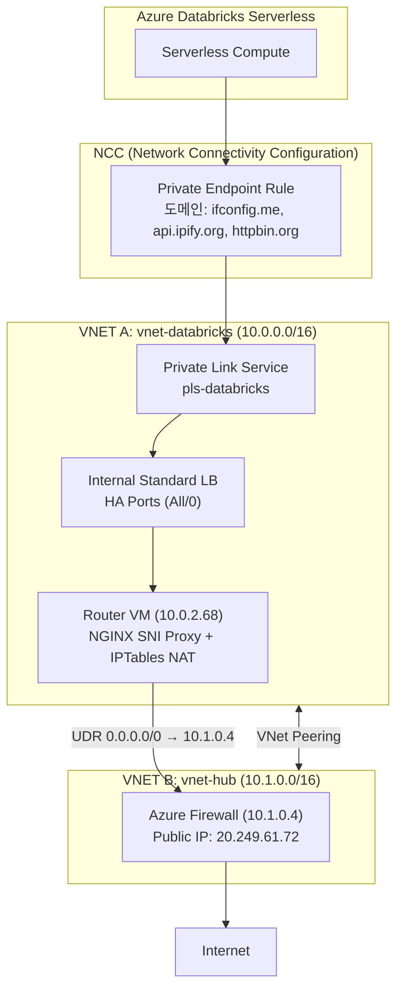

### 핵심 리소스 정보

| 리소스 | 값 |
|--------|-----|
| Resource Group | `rg-databricks-networking` |
| Firewall Public IP | `20.249.61.72` |
| Firewall Private IP | `10.1.0.4` |
| Router VM Private IP | `10.0.2.68` |
| Databricks Workspace URL | `adb-7405610730276790.10.azuredatabricks.net` |
| NCC Name | `ncc-databricks-koreacentral` |
| PE Domains | `ifconfig.me`, `api.ipify.org`, `httpbin.org` |

---

## 2. 배포 단계

### 2-1. 인프라 배포 (Bicep)

```bash
chmod +x scripts/deploy.sh
./scripts/deploy.sh
```

**배포되는 리소스:**
- VNET A (`vnet-databricks`, 10.0.0.0/16) — PLS, LB, Router VM
- VNET B (`vnet-hub`, 10.1.0.0/16) — Azure Firewall
- VNet Peering (A ↔ B)
- Internal Standard Load Balancer (HA Ports)
- Private Link Service
- Router VM (NGINX SNI Proxy + IPTables MASQUERADE)
- Azure Firewall + Policy + Log Analytics
- Azure Databricks Workspace (Premium)

---

### 2-2. NCC 생성 (Databricks Account Console)

1. `adminm@test.onmicrosoft.com` (Global Admin 계정)으로 [accounts.azuredatabricks.net](https://accounts.azuredatabricks.net) 접속
2. 좌측 메뉴 **Cloud resources** > **Network connectivity configurations** > **Add network configuration**
3. 설정:
   - Name: `ncc-databricks-koreacentral`
   - Region: `koreacentral`

> 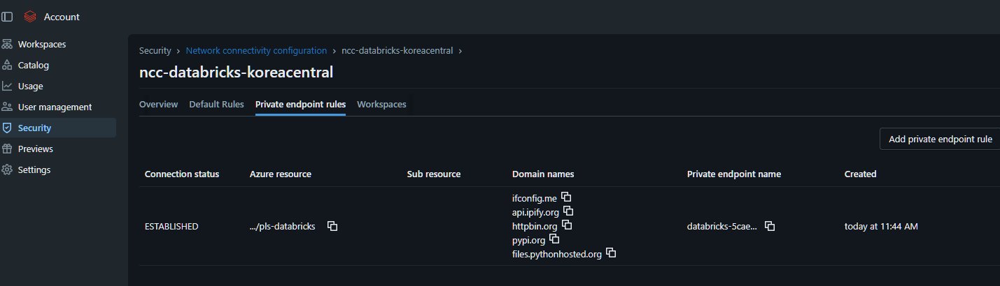
> 
> Account Console > Cloud resources > NCC 목록

> **참고:** NCC 생성은 REST API로도 가능합니다:
> ```bash
> curl -X POST "https://accounts.azuredatabricks.net/api/2.0/accounts/{ACCOUNT_ID}/network-connectivity-configs" \
>   -H "Authorization: Bearer {TOKEN}" \
>   -d '{"name": "ncc-databricks-koreacentral", "region": "koreacentral"}'
> ```

---

### 2-3. Private Endpoint Rule 추가 (도메인 기반)

NCC에 PLS를 가리키는 Private Endpoint Rule을 **도메인 이름과 함께** 추가합니다.

```bash
curl -X POST "https://accounts.azuredatabricks.net/api/2.0/accounts/{ACCOUNT_ID}/network-connectivity-configs/{NCC_ID}/private-endpoint-rules" \
  -H "Authorization: Bearer {TOKEN}" \
  -H "Content-Type: application/json" \
  -d '{
    "resource_id": "/subscriptions/{SUB_ID}/resourceGroups/rg-databricks-networking/providers/Microsoft.Network/privateLinkServices/pls-databricks",
    "domain_names": ["ifconfig.me", "api.ipify.org", "httpbin.org"]
  }'
```

---

### 2-4. Private Endpoint 승인 (Azure Portal)

1. Azure Portal > **Private Link services** > `pls-databricks`
2. **Private endpoint connections** 클릭
3. Pending 상태의 endpoint 선택 > **Approve**

```bash
# CLI로 승인
az network private-link-service connection update \
  -g rg-databricks-networking --service-name pls-databricks \
  --name "{PE_CONNECTION_NAME}" \
  --connection-status Approved --description "Approved"
```

- Azure Portal > PLS > Private endpoint connections > 상태 `Approved`
- Account Console > Cloud resources > Network connectivity configurations > NCC 선택 > PE Rule 상태 `ESTABLISHED`

---

### 2-5. NCC를 Workspace에 연결

```bash
curl -X PATCH "https://accounts.azuredatabricks.net/api/2.0/accounts/{ACCOUNT_ID}/workspaces/{WORKSPACE_ID}" \
  -H "Authorization: Bearer {TOKEN}" \
  -H "Content-Type: application/json" \
  -d '{"network_connectivity_config_id": "{NCC_ID}"}'
```

Account Console > Workspaces > 대상 Workspace > NCC 연결 상태

> ⚠️ NCC 연결 후 **10분 대기** 필요. 기존 Serverless 리소스는 재시작해야 함.

---

## 3. 검증 및 모니터링

Databricks 노트북을 **Serverless 컴퓨팅**으로 실행하면서, 각 구간의 로그를 동시에 확인하여 트래픽 흐름을 검증합니다.

### 3-1. Databricks Serverless 노트북 (ADB)

**확인 위치:** Databricks Workspace > Notebook 실행 결과 (Network Policy - ALL Allow인 경우)

Workspace에서 `test-connectivity.py` 노트북을 실행한 결과:

| 테스트 도메인 | 반환 IP | 경로 | 결과 |
|--------------|---------|------|------|
| `ifconfig.me` | **20.249.61.72** | PE → PLS → LB → VM → Firewall | ✅ Firewall IP |
| `api.ipify.org` | **20.249.61.72** | PE → PLS → LB → VM → Firewall | ✅ Firewall IP |
| `httpbin.org` | **20.249.61.72** | PE → PLS → LB → VM → Firewall | ✅ Firewall IP |
| `ipinfo.io` | 20.200.241.xxx | Serverless 기본 NAT | PE 도메인 아님 |

**DNS Resolution 확인:**
```
ifconfig.me        → 172.18.0.250  (PLS NAT IP — PE 경로로 라우팅됨)
login.microsoft... → 20.190.xxx    (Azure 직접 연결)
management.azure.. → 4.150.xxx     (Azure 직접 연결)
```

PE 도메인은 `172.18.0.250`(PLS NAT IP)으로 해석 → 이 IP로 향하는 트래픽이 PLS → LB → Router VM으로 전달됩니다.

```python
# 노트북에서 실행
import urllib.request, json, socket

# 외부 IP 확인
print(urllib.request.urlopen("https://ifconfig.me/ip", timeout=10).read().decode().strip())

# DNS 확인
ips = socket.getaddrinfo("ifconfig.me", 443, socket.AF_INET)
print([ip[4][0] for ip in ips])
```

> **📸 스크린샷:**
>
> 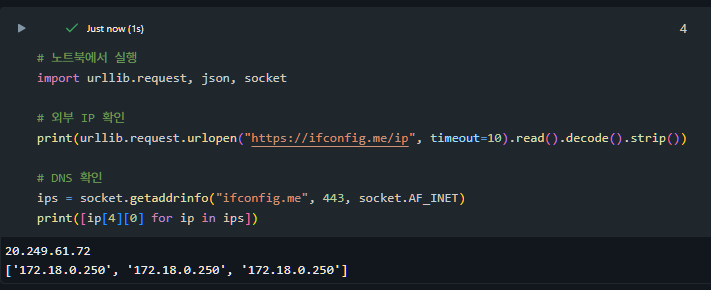
>
> *Serverless 노트북에서 ifconfig.me → 20.249.61.72 (Firewall IP), DNS → 172.18.0.250 (PLS NAT IP) 확인*

---

### 3-2. Private Link Service (PLS)

**확인 위치:** Azure Portal > `pls-databricks` > **Private endpoint connections**

**확인 내용:** PE 연결 상태가 `Approved`인지 확인

```bash
az network private-link-service show \
  -g rg-databricks-networking -n pls-databricks \
  --query "privateEndpointConnections[].{Name:name, Status:privateLinkServiceConnectionState.status}" \
  -o table
```

**실제 결과:**
```
Name                                            Status
----------------------------------------------  --------
databricks-5caea266-...1fd1247c-...7ada4b7e1ae4  Approved
```

> **📸 스크린샷:**
>
> 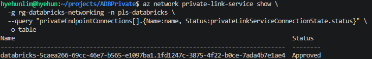
>
> *Azure Portal > Private Link Service > PE Connection 상태 = Approved*

---

### 3-3. Internal Load Balancer (LB)

**확인 위치:** Azure Portal > `lb-databricks-internal` > **Monitoring** > **Metrics**

**확인 내용:**
- Health Probe Status → 100% = Backend VM Healthy
- Byte Count → 노트북 실행 시 트래픽 증가 확인

```bash
# Backend Pool 멤버 확인
az network lb address-pool show \
  -g rg-databricks-networking \
  --lb-name lb-databricks-internal \
  -n be-router-pool \
  --query "backendIPConfigurations[].id" -o tsv
```

**Metrics 확인 (Azure Portal):**
1. `lb-databricks-internal` > **Metrics**
2. Metric: `Health Probe Status` → 100%
3. Metric: `Byte Count` → 노트북 실행 전후 증가

> **📸 스크린샷:**
>
> 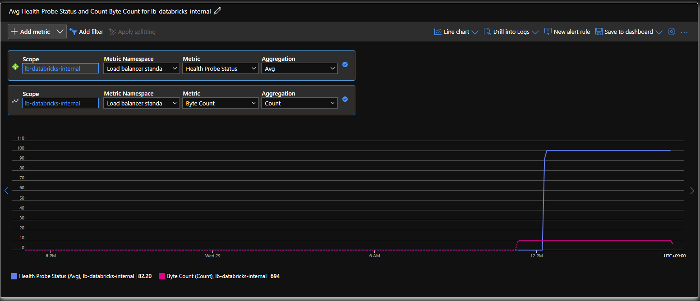
>
> *Azure Portal > LB > Metrics > Byte Count (노트북 실행 시 증가)*

---

### 3-4. Router VM (SNI Proxy)

**확인 위치:** SSH 접속 (`ssh -p 2222 azureuser@20.249.61.72`, Firewall DNAT)

**확인 내용:** NGINX SNI Proxy 로그, IPTables NAT 카운터, 외부 IP

```bash
# 1. SNI Proxy 로그 실시간 감시 (★ 가장 중요)
tail -f /var/log/nginx/sni-proxy-access.log

# 노트북 실행 시 출력 예시:
# 10.0.2.69 [29/Apr/2026:03:40:35 +0000] SNI=ifconfig.me upstream=34.117.59.81:443
# 10.0.2.69 [29/Apr/2026:03:40:35 +0000] SNI=api.ipify.org upstream=64.185.227.155:443
# 10.0.2.69 [29/Apr/2026:03:40:37 +0000] SNI=httpbin.org upstream=34.227.213.82:443
```

```bash
# 2. IPTables NAT 카운터 (before/after 비교)
iptables -t nat -L POSTROUTING -n -v
# pkts 카운터가 노트북 실행 전후로 증가하면 트래픽이 VM을 통과한 것

# 3. 실시간 패킷 캡처
tcpdump -i eth0 port 443 -n -c 20

# 4. VM 외부 IP 확인
curl -s https://ifconfig.me/ip   # → 20.249.61.72
```

**`az vm run-command`로 원격 확인 (SSH 없이):**
```bash
az vm run-command invoke -g rg-databricks-networking -n vm-router-01 \
  --command-id RunShellScript \
  --scripts 'tail -20 /var/log/nginx/sni-proxy-access.log; echo "---"; iptables -t nat -L POSTROUTING -n -v' \
  --query "value[0].message" -o tsv
```

> **📸 스크린샷:**
>
> 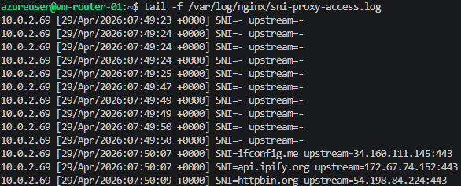
>
> *SSH 접속 후 `tail -f /var/log/nginx/sni-proxy-access.log` — SNI=ifconfig.me 트래픽 확인*
>
> 
>
> *IPTables MASQUERADE 패킷 카운터 — 노트북 실행 전후 증가*

---

### 3-5. Azure Firewall

**확인 위치:** Azure Portal > `afw-hub` > **Logs** (Log Analytics)

**확인 내용:** Application Rule 로그에서 허용/차단된 FQDN, Source IP = Router VM(`10.0.2.68`)

**KQL 쿼리 — PE 도메인 트래픽:**
```kql
AZFWApplicationRule
| where TimeGenerated > ago(1h)
| where SourceIp startswith "10.0.2."
| where Fqdn in ("ifconfig.me", "api.ipify.org", "httpbin.org", "pypi.org", "files.pythonhosted.org")
| project TimeGenerated, SourceIp, Fqdn, Action, Protocol
| order by TimeGenerated desc
| take 30
```

**KQL 쿼리 — 차단된 트래픽만:**
```kql
AZFWApplicationRule
| where TimeGenerated > ago(1h)
| where Action == "Deny"
| where SourceIp startswith "10.0.2."
| project TimeGenerated, SourceIp, Fqdn, TargetUrl
| order by TimeGenerated desc
```

**실제 로그 결과:**

| Time (UTC) | Source IP | FQDN | Action |
|------------|-----------|------|--------|
| 03:40:35 | 10.0.2.68 | ifconfig.me | **Allow** |
| 03:40:35 | 10.0.2.68 | api.ipify.org | **Allow** |
| 03:40:37 | 10.0.2.68 | httpbin.org | **Allow** |

**CLI로 확인:**
```bash
az monitor log-analytics query \
  --workspace "2d10ce55-2524-4890-af38-c943d1044e73" \
  --analytics-query "AZFWApplicationRule | where SourceIp startswith '10.0.2.' | where Fqdn in ('ifconfig.me','api.ipify.org','httpbin.org','pypi.org') | project TimeGenerated, SourceIp, Fqdn, Action | order by TimeGenerated desc | take 20" \
  -o table
```

> **📸 스크린샷:**
>
> 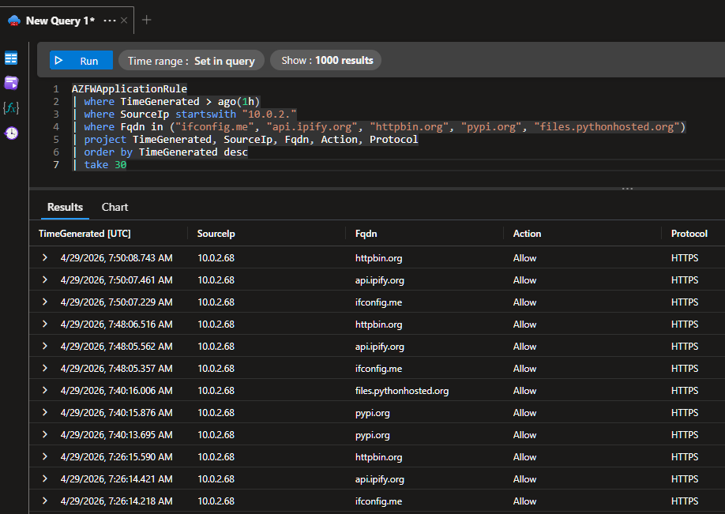
>
> *Azure Portal > Firewall > Logs > KQL 결과 — ifconfig.me, api.ipify.org Allow*
>
> 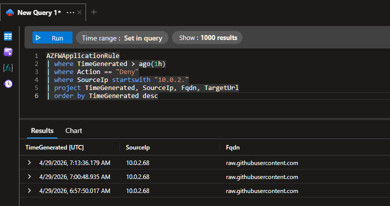
>
> *Azure Portal > Firewall > Logs > 차단된 트래픽 (deny-by-default)*

---

### 3-6. NCC / Account Console

**확인 위치:** [accounts.azuredatabricks.net](https://accounts.azuredatabricks.net) > **Cloud resources** > **Network connectivity configurations** > NCC 선택

**확인 내용:** PE Rule 상태 `ESTABLISHED`, 등록 도메인 목록, Workspace 연결 상태

```bash
# API로 확인
TOKEN=$(az account get-access-token --resource 2ff814a6-3304-4ab8-85cb-cd0e6f879c1d --query accessToken -o tsv)
curl -s -H "Authorization: Bearer $TOKEN" \
  "https://accounts.azuredatabricks.net/api/2.0/accounts/15d6e4b8-9bc7-49f0-b337-4148e982eb8b/network-connectivity-configs/5caea266-69cc-46e7-b565-e1097ba17b5e/private-endpoint-rules" \
  | python3 -m json.tool
```

> **📸 스크린샷:**
>
> 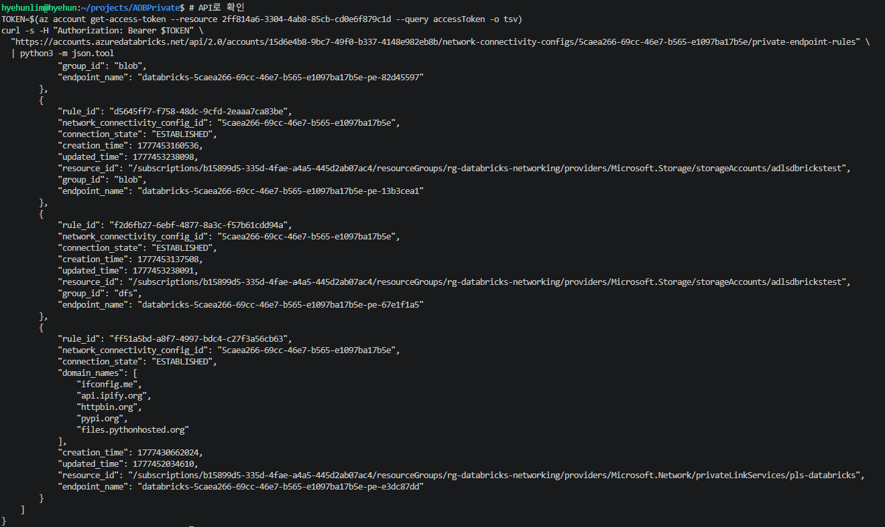
>
> *Account Console > Cloud resources > Network connectivity configurations > NCC > PE Rules — 상태 ESTABLISHED, 도메인 5개*
>
> 
>
> *Account Console > Workspaces > 대상 Workspace 선택 > Network connectivity configuration 연결 상태*

---

### 검증 체크리스트

| # | 시나리오 | 확인 위치 | 기대 결과 |
|---|---------|----------|----------|
| 1 | `ifconfig.me` 외부 IP | ① ADB 노트북 | `20.249.61.72` (Firewall IP) |
| 2 | `ipinfo.io` 외부 IP | ① ADB 노트북 | `20.200.241.xxx` (Serverless NAT) |
| 3 | `ifconfig.me` DNS | ① ADB 노트북 | `172.18.0.250` (PLS NAT IP) |
| 4 | PE Connection 상태 | ② PLS (Portal) | `Approved` |
| 5 | LB Health Probe | ③ LB Metrics | `100%` |
| 6 | SNI Proxy 로그 | ④ VM SSH | `SNI=ifconfig.me` |
| 7 | Firewall Allow 로그 | ⑤ Firewall Logs | `ifconfig.me → Allow` |
| 8 | Firewall Deny 로그 | ⑤ Firewall Logs | 미허용 FQDN → `Deny` |
| 9 | PE Rule 상태 | ⑥ Account Console | `ESTABLISHED` |
| 10 | `%pip install` | ① ADB 노트북 | 성공 (pypi.org 경유) |

---

## 4. 트래픽 흐름 설명

### PE 도메인 트래픽 (Firewall 경유)

```
① Serverless Notebook에서 https://ifconfig.me 요청
② NCC PE Rule에서 도메인 매칭 → DNS를 172.18.0.250 (PLS NAT IP)으로 해석
③ Private Endpoint → PLS로 TCP 연결 전달
④ PLS → Internal LB (HA Ports) → Router VM (10.0.2.68)
⑤ Router VM의 NGINX SNI Proxy가 TLS ClientHello에서 SNI=ifconfig.me 읽음
⑥ DNS 재해석 → 실제 ifconfig.me IP로 TCP proxy
⑦ IPTables MASQUERADE NAT (Source IP → 10.0.2.68)
⑧ UDR 0.0.0.0/0 → Firewall (10.1.0.4)
⑨ Firewall Application Rule에서 ifconfig.me FQDN 허용 → 인터넷 전달
⑩ 응답 역경로로 반환 → Notebook에서 20.249.61.72 수신
```

### 비-PE 도메인 트래픽 (기본 NAT)

```
① Serverless Notebook에서 https://ipinfo.io 요청
② NCC PE Rule에 ipinfo.io가 없음 → 기본 Serverless NAT 사용
③ Databricks 관리 NAT Gateway → 20.200.241.xxx로 인터넷 접근
④ Firewall을 경유하지 않음
```

---

## 5. 주요 구성 요소 상세

### Router VM — NGINX SNI Proxy

> ### ⚠️ 중요: IPTables NAT(MASQUERADE)만으로는 통신이 되지 않습니다
>
> ```bash
> sudo iptables -t nat -A POSTROUTING -o eth0 -j MASQUERADE
> ```
>
> 그러나 **이 설정만으로는 Domain-based PE Rule을 통한 인터넷 도메인 트래픽이 작동하지 않습니다.**
>
> #### 문제 원인: PLS에 의한 목적지 IP 소실
>
> Domain-based PE Rule의 트래픽이 Router VM에 도착하는 과정에서 **Private Link Service(PLS)가 원래 목적지 IP를 제거**합니다:
>
> ```
> 1. Serverless에서 ifconfig.me 요청
> 2. DNS → 172.18.0.250 (PLS NAT IP)로 해석
> 3. PE → PLS → LB를 거치면서 dst IP = 10.0.2.68 (Router VM 자체 IP)로 변환
> 4. Router VM 도착 시: src=10.0.2.x, dst=10.0.2.68
>    → 원래 목적지(ifconfig.me)의 IP 정보가 완전히 소실됨
> ```
>
> IPTables MASQUERADE는 **패킷의 dst IP를 기반으로 라우팅**하므로, dst가 Router VM 자신의 IP인 패킷을 어디로 전달해야 하는지 알 수 없습니다. 결과적으로 **연결 타임아웃**이 발생합니다.
>
> #### 해결: NGINX Stream SNI Proxy
>
> TLS 핸드셰이크의 **ClientHello 메시지에는 SNI(Server Name Indication) 필드**가 평문으로 포함되어 있습니다. 이 필드는 PLS/LB NAT를 거쳐도 **보존**됩니다.
>
> NGINX Stream 모듈의 `ssl_preread`를 사용하면:
> 1. ClientHello에서 SNI 필드 추출 (예: `ifconfig.me`)
> 2. DNS로 해당 호스트명을 실제 IP로 resolve
> 3. 해당 IP로 TCP 연결을 프록시
>
> ```
> 패킷 도착 (dst=10.0.2.68:443)
>   → NGINX가 TLS ClientHello에서 SNI="ifconfig.me" 읽음
>   → DNS resolve: ifconfig.me → 실제 IP
>   → IPTables MASQUERADE로 src NAT 후 Firewall(10.1.0.4) 경유하여 전달
> ```
>
> | 방식 | 원래 목적지 복구 | 동작 여부 |
> |------|:-:|:-:|
> | IPTables MASQUERADE만 | ✗ (dst IP 소실) | **✗ 타임아웃** |
> | IPTables DNAT (IP 하드코딩) | 도메인당 수동 설정 필요 | △ (비실용적) |
> | **NGINX SNI Proxy + MASQUERADE** | **✓ (TLS SNI에서 추출)** | **✓ 정상 동작** |
>
> **결론:** Domain-based PE Rule을 사용하는 이 아키텍처에서는 **SNI Proxy 설정이 필수**입니다. IPTables NAT만 구성하면 HTTPS 트래픽은 반드시 실패합니다.
>
> #### 원본 가이드 대비 추가해야 하는 작업
>
> [원본 가이드](https://github.com/jiyongseong/azure-tips-and-tricks/blob/main/ADB/Networking/Azure_Databricks_Serverless_%EB%84%A4%ED%8A%B8%EC%9B%8C%ED%81%AC_%EA%B5%AC%EC%84%B1_%EA%B0%80%EC%9D%B4%EB%93%9C.md)의 **Step 5 (7.1~7.4)**까지 그대로 수행한 뒤, 아래 3단계를 **추가**로 수행해야 합니다.
>
> **추가 ①: `libnginx-mod-stream` 패키지 설치**
>
> 원본 가이드 7.4절에서 NGINX를 Health Probe 용도(포트 8082)로만 설치합니다. SNI Proxy에는 NGINX Stream 모듈이 필요하므로 추가 설치합니다:
>
> ```bash
> sudo apt-get install -y libnginx-mod-stream
> ```
>
> **추가 ②: SNI Proxy 설정 파일 생성**
>
> `/etc/nginx/stream-sni-proxy.conf` 파일을 새로 만듭니다:
>
> ```bash
> sudo tee /etc/nginx/stream-sni-proxy.conf << 'EOF'
> stream {
>     resolver 168.63.129.16 valid=30s;
>     resolver_timeout 5s;
>
>     log_format sni_log '$remote_addr [$time_local] SNI=$ssl_preread_server_name upstream=$upstream_addr';
>     access_log /var/log/nginx/sni-proxy-access.log sni_log;
>
>     map $ssl_preread_server_name $target_backend {
>         default $ssl_preread_server_name:443;
>     }
>
>     server {
>         listen 443;
>         ssl_preread on;
>         proxy_pass $target_backend;
>         proxy_connect_timeout 10s;
>         proxy_timeout 30s;
>     }
> }
> EOF
> ```
>
> **추가 ③: `nginx.conf`에 Stream 설정 include 추가**
>
> NGINX 메인 설정 파일의 **최상위 레벨(http 블록 바깥)**에 include 지시어를 추가합니다:
>
> ```bash
> # nginx.conf 맨 끝에 include 추가
> echo 'include /etc/nginx/stream-sni-proxy.conf;' | sudo tee -a /etc/nginx/nginx.conf
>
> # 설정 검증 후 재시작
> sudo nginx -t && sudo systemctl restart nginx
> ```
>
> **변경 전후 비교:**
>
> | 항목 | 원본 가이드 (7.3~7.4) | 추가 후 |
> |------|---------------------|---------|
> | **패키지** | `nginx` | `nginx` + `libnginx-mod-stream` |
> | **포트 8082** | Health Probe 응답 (HTTP) | 동일 (변경 없음) |
> | **포트 443** | ✗ 설정 없음 | ✅ SNI Proxy (TLS ClientHello → DNS resolve → TCP proxy) |
> | **설정 파일** | `/etc/nginx/sites-available/health-probe` | 동일 + `/etc/nginx/stream-sni-proxy.conf` 추가 |
> | **IPTables** | `MASQUERADE` (모든 아웃바운드) | 동일 (변경 없음 — SNI Proxy가 만든 새 연결에 MASQUERADE 적용) |
>
> 위 3단계 적용 후, 원본 가이드의 나머지 절차(Step 6~12)를 그대로 진행하면 됩니다.

### Azure Firewall — Application Rules

| Rule Collection | FQDN | Action |
|----------------|------|--------|
| rc-databricks-allowed | `*.microsoft.com`, `*.blob.core.windows.net` 등 | Allow |
| rc-apt-repos | `*.ubuntu.com` | Allow |
| Allow-ifconfig | `ifconfig.me`, `api.ipify.org`, `httpbin.org` 등 | Allow |
| (default) | 그 외 모든 FQDN | **Deny** |

---

## 6. IP 정리

| IP | 설명 |
|----|------|
| `20.249.61.72` | Azure Firewall Public IP — PE 도메인 트래픽의 출구 |
| `20.200.241.xxx` | Databricks Serverless 기본 NAT IP — 비-PE 도메인 출구 |
| `10.0.2.68` | Router VM Private IP — Firewall 로그의 Source IP |
| `172.18.0.250` | PLS NAT IP — PE 도메인의 DNS 해석 결과 |
| `10.1.0.4` | Firewall Private IP — UDR next-hop |

---

## 7. 추가 테스트 — Azure Storage (Resource PE) 접근 검증

Domain-based PE Rule은 인터넷 FQDN 트래픽을 Firewall 경유로 라우팅하지만, **Azure PaaS 서비스(Storage, SQL 등)**에 대한 접근은 **Resource-based PE Rule**로 별도 구성합니다.

### 두 가지 PE Rule 비교

| 항목 | Domain-based PE Rule | Resource-based PE Rule |
|------|---------------------|----------------------|
| **대상** | 인터넷 FQDN (ifconfig.me, pypi.org 등) | Azure PaaS (Storage, SQL 등) |
| **경로** | PE → PLS → LB → Router VM(SNI) → Firewall → Internet | Managed PE → Azure Backbone → PaaS 직접 |
| **고객 VNet 경유** | ✅ (Firewall 로깅/필터링 가능) | ❌ (Azure 내부 직접 연결) |
| **SNI Proxy 필요** | ✅ 필수 | ❌ 불필요 |
| **Firewall 로그** | ✅ 기록됨 | ❌ 기록 안 됨 |

```
[Domain PE — 인터넷 트래픽]
Serverless → Domain PE → PLS → LB → Router VM(SNI) → Firewall → Internet
                         ^^^^^^^^^^^^^^^^^^^^^^^^^^^^^^^^^^^^^^^^
                         고객 VNet 경유

[Resource PE — Azure PaaS 트래픽]
Serverless → Managed PE → Azure Backbone → Storage Account
                          ^^^^^^^^^^^^^^^^
                          Azure 내부 직접 연결 (고객 VNet 미경유)
```

### 7-1. 사전 구성

#### Storage Account 생성 (ADLS Gen2)

```bash
# HNS(Hierarchical Namespace) 활성화된 ADLS Gen2 생성
az storage account create \
  -g rg-databricks-networking \
  -n adlsdbrickstest \
  -l koreacentral \
  --sku Standard_LRS \
  --kind StorageV2 \
  --hns true \
  --public-network-access Enabled \
  --allow-blob-public-access false

# 파일시스템(컨테이너) 생성 및 샘플 데이터 업로드
az storage fs create -n testdata --account-name adlsdbrickstest --auth-mode login
az storage fs file upload \
  --file-system testdata \
  --account-name adlsdbrickstest \
  --source sample_sales.csv \
  --path sales/sample_sales.csv \
  --auth-mode login --overwrite
```

#### Access Connector + RBAC 설정

```bash
# Databricks Access Connector 생성 (Managed Identity)
az databricks access-connector create \
  -g rg-databricks-networking \
  -n ac-databricks \
  -l koreacentral \
  --identity-type SystemAssigned

# Access Connector MI에 Storage Blob Data Contributor 부여
AC_PRINCIPAL=$(az databricks access-connector show \
  -g rg-databricks-networking -n ac-databricks \
  --query identity.principalId -o tsv)

az role assignment create \
  --assignee "$AC_PRINCIPAL" \
  --role "Storage Blob Data Contributor" \
  --scope "/subscriptions/{SUB_ID}/resourceGroups/rg-databricks-networking/providers/Microsoft.Storage/storageAccounts/adlsdbrickstest"
```

### 7-2. NCC Resource PE Rule 추가

Account Console API 또는 UI에서 NCC에 **Resource-based PE Rule**을 추가합니다.

```bash
# DFS sub-resource PE Rule
curl -X POST "https://accounts.azuredatabricks.net/api/2.0/accounts/{ACCOUNT_ID}/network-connectivity-configs/{NCC_ID}/private-endpoint-rules" \
  -H "Authorization: Bearer $TOKEN" \
  -H "Content-Type: application/json" \
  -d '{
    "resource_id": "/subscriptions/{SUB_ID}/resourceGroups/rg-databricks-networking/providers/Microsoft.Storage/storageAccounts/adlsdbrickstest",
    "group_id": "dfs"
  }'

# Blob sub-resource PE Rule (Delta 쓰기 등 일부 연산에 필요)
curl -X POST "https://accounts.azuredatabricks.net/api/2.0/accounts/{ACCOUNT_ID}/network-connectivity-configs/{NCC_ID}/private-endpoint-rules" \
  -H "Authorization: Bearer $TOKEN" \
  -H "Content-Type: application/json" \
  -d '{
    "resource_id": "/subscriptions/{SUB_ID}/resourceGroups/rg-databricks-networking/providers/Microsoft.Storage/storageAccounts/adlsdbrickstest",
    "group_id": "blob"
  }'
```

### 7-3. PE Connection 승인

Storage Account에서 Pending 상태의 PE Connection을 승인합니다.

```bash
# PE Connection 목록 확인
az network private-endpoint-connection list \
  --id "/subscriptions/{SUB_ID}/resourceGroups/rg-databricks-networking/providers/Microsoft.Storage/storageAccounts/adlsdbrickstest" \
  -o table

# DFS PE 승인
az network private-endpoint-connection approve \
  --id "{PE_CONNECTION_ID_DFS}" \
  --description "Approved for Databricks Serverless"

# Blob PE 승인
az network private-endpoint-connection approve \
  --id "{PE_CONNECTION_ID_BLOB}" \
  --description "Approved for Databricks Serverless"
```

### 7-4. Unity Catalog 연결 설정

Databricks Workspace API로 Storage Credential과 External Location을 생성합니다.

```bash
# Storage Credential 생성
curl -X POST "https://{WORKSPACE_URL}/api/2.1/unity-catalog/storage-credentials" \
  -H "Authorization: Bearer $WS_TOKEN" \
  -d '{
    "name": "sc-test-storage",
    "azure_managed_identity": {
      "access_connector_id": "/subscriptions/{SUB_ID}/resourceGroups/rg-databricks-networking/providers/Microsoft.Databricks/accessConnectors/ac-databricks"
    }
  }'

# External Location 생성 (dfs 엔드포인트)
curl -X POST "https://{WORKSPACE_URL}/api/2.1/unity-catalog/external-locations" \
  -H "Authorization: Bearer $WS_TOKEN" \
  -d '{
    "name": "el-test-storage",
    "url": "abfss://testdata@adlsdbrickstest.dfs.core.windows.net/",
    "credential_name": "sc-test-storage"
  }'
```

### 7-5. 검증 — Serverless 노트북 실행

Serverless Compute에서 `notebooks/test-storage.py` 노트북을 실행합니다.

> **📸 스크린샷:**
>
> 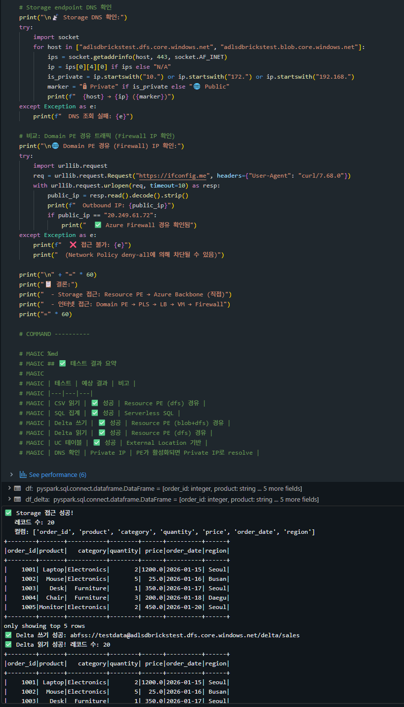
>
> *Serverless 노트북에서 ADLS Gen2 CSV 읽기, Delta 쓰기/읽기, SQL 집계 성공 화면*

#### 테스트 항목 및 기대 결과

| # | 테스트 | 기대 결과 | 비고 |
|---|--------|----------|------|
| 1 | CSV 파일 읽기 (`spark.read.csv`) | ✅ 성공 | Resource PE (dfs) 경유 |
| 2 | SQL 집계 (카테고리별/지역별 매출) | ✅ 성공 | Serverless SQL |
| 3 | Delta 테이블 쓰기 | ✅ 성공 | Resource PE (blob+dfs) 경유 |
| 4 | Delta 테이블 읽기 | ✅ 성공 | Resource PE (dfs) 경유 |
| 5 | Unity Catalog 테이블 생성 | ✅ 성공 | External Location 기반 |
| 6 | Storage DNS 확인 | Private IP | PE 활성화 시 Private IP로 resolve |

### 7-6. Router VM SNI Proxy 로그 비교

Storage 접근 시 Router VM의 SNI Proxy 로그에는 **Storage 관련 트래픽이 기록되지 않습니다**. Resource PE는 고객 VNet을 경유하지 않기 때문입니다.

```bash
# Router VM에서 확인
sudo tail -50 /var/log/nginx/sni-proxy-access.log

# Storage 도메인이 로그에 없음을 확인
# (ifconfig.me, pypi.org 등 Domain PE 트래픽만 기록됨)
```

> **📸 스크린샷:**
>
> 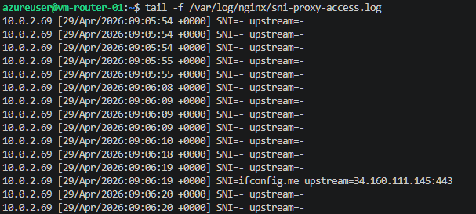
>
> *Router VM SNI Proxy 로그 — Storage 트래픽(adlsdbrickstest)은 기록되지 않으며, Domain PE 트래픽(ifconfig.me, pypi.org 등)만 기록됨. Resource PE는 Azure Backbone 직접 연결이므로 고객 VNet을 경유하지 않음을 확인*

### 검증 요약

| 경로 | 트래픽 | VM SNI 로그 | Firewall 로그 |
|------|--------|:-----------:|:------------:|
| Domain PE → Firewall | ifconfig.me, pypi.org 등 | ✅ 기록됨 | ✅ 기록됨 |
| Resource PE → Azure Backbone | adlsdbrickstest (dfs/blob) | ❌ 없음 | ❌ 없음 |

> **핵심:** Azure PaaS 서비스는 Resource PE를 통해 Azure 내부 백본으로 직접 연결되므로, 고객 VNet의 PLS/LB/Router VM/Firewall 체인을 **경유하지 않습니다**. 이는 보안과 성능 모두에서 이점이 있습니다.

---

## 8. 정리 (리소스 삭제)

```bash
chmod +x scripts/cleanup.sh
./scripts/cleanup.sh
```

---

## 9. 참고 자료

- [Azure Databricks Serverless 네트워크 구성 가이드 (원본)](https://github.com/jiyongseong/azure-tips-and-tricks/blob/main/ADB/Networking/Azure_Databricks_Serverless_%EB%84%A4%ED%8A%B8%EC%9B%8C%ED%81%AC_%EA%B5%AC%EC%84%B1_%EA%B0%80%EC%9D%B4%EB%93%9C.md) — ⚠️ 원본 가이드의 Step 5(7.3절) IPTables NAT 구성만으로는 Domain PE 트래픽이 동작하지 않습니다. **본 가이드 섹션 5의 NGINX SNI Proxy 설정이 반드시 필요합니다.**
- [Securing Azure Databricks Serverless: Practical Guide to Private Link Integration](https://techcommunity.microsoft.com/blog/analyticsonazure/securing-azure-databricks-serverless-practical-guide-to-private-link-integration/4457083)
- [Configure private connectivity to resources in your VNet](https://learn.microsoft.com/en-us/azure/databricks/security/network/serverless-network-security/pl-to-internal-network)
- [Configure private connectivity to Azure resources](https://learn.microsoft.com/en-us/azure/databricks/security/network/serverless-network-security/serverless-private-link)
- [What is serverless egress control? (Network Policy)](https://learn.microsoft.com/en-us/azure/databricks/security/network/serverless-network-security/network-policies)
